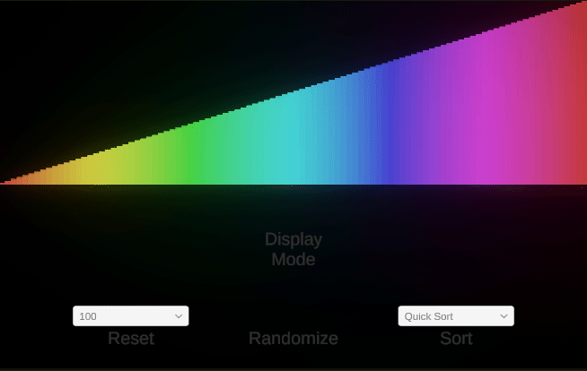
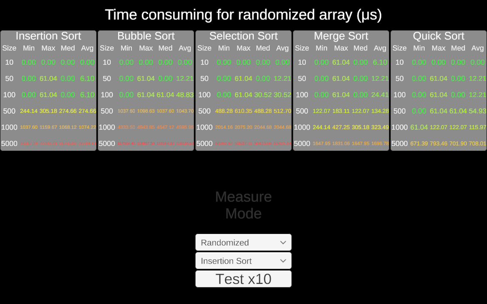

# DSA Sort Visual
[Play at Itch.io](https://playerzongying.itch.io/dsa-sort-visual) 

I did a small unity project to visualize the sorting process and measure time consuming for different sorting algorithms, including insert sort, bubble sort, selection sort, merge sort, and quick sort.

The unity project has 2 modes: 

1. The display mode to show the sorting process (doesn't represent the time consuming in real-time), 
2. The measure mode to show the time consuming.

In the display mode, you set the array size, randomize it, sort it in different algorithms and see the process.

The array being randomized and sorted over time contains float numbers ranging from 0 to 1 with the same interval among them according to the array size (for example, 0.1, 0.2, 0.3 … 0.9, 1.0 for size 10, and 0.01, 0.02, 0.03 … 0.99, 1.00 for size 100).

In the measure mode, you can test different algorithms on either a randomized array or a sorted array.

When the test button is clicked, the selected algorithm will run 10 times on different-sized arrays, and the maximum, minimum, median, and average time consumption will be shown in microseconds.  

Here shows some testing results for all algorithms in one session.

